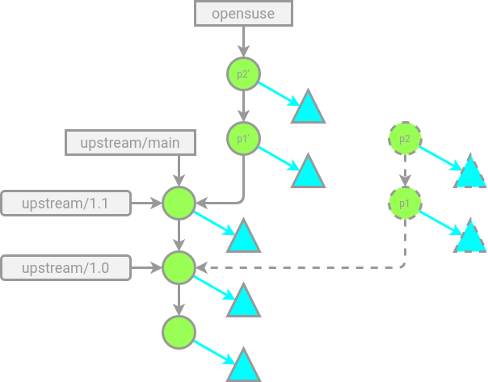
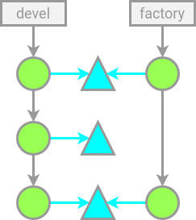
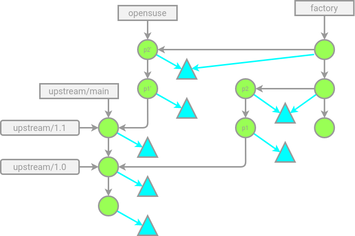

# Git Native Packaging

## Pristine Sources

We stand on the shoulders of giants. So in order to define the
future we should learn from the past. So let's take a look back.

Packaging for a distribution means taking sources from upstream
projects, applying fixes and modifications, adding some
configuration and then build the result by calling some commands.

RPM formalized the process following a "pristine sources"
philosophy[^1][^2]. The idea came from an old distribution called
BOGUS[^3][^4]. The approach is basically to take the unmodified
sources as released by upstream and store required changes in the form
of patches as well as a build description next to them. In RPM speak
the build description is called "spec file" and contains
instructions on how to apply the patches to the sources and how to
build the sources to produce binary packages.

Oversimplified example:

	Name:    hello
	Version: 1.0
	Source:  hello-1.0.tar.gz
	Patch:   hello-bugfix.patch

	%prep
	%autosetup

	%build
	./configure --prefix=/usr
	make

	%install
	make install

	%files
	/usr/bin/hello

A crucial aspect is that it must be easy for humans to understand
what is going on. In the above example that should be pretty
obvious. The only magic in there is the `%autosetup` macro that
extracts the tarball and applies the patch.

In order to add a new patch, just add another `Patch` line. To
upgrade to a newer version, adjust the version, change the tarball
and potentially rebase the patches.

That makes it easy for developers of the distribution as the
standard procedure helps to scale. Any packager basically knows how
to update any package. Also customers who like to take advantage
open source can apply customizations in straight forward way based
on the distributions's sources.

## Pristine Sources and Git

Times have changed. The distributed version control system `git`
dominates the free software world. The vast majority of upstream
projects use `git` for development. So manually creating binary
tarballs and uploading them to some `ftp` server is not necessarily
the preferred method to release software anymore. Instead it's much
easier to create a signed git tag.

On the downstream side juggling tarballs and manually applying
patches is no longer a natural workflow. It would be much easier to
just branch the upstream code at the release tag and apply git
commits on top.

Let's make up a simple example pacakge. We assume the history has a
chain of three commits (circles). There's a tag for version 1.0
(rectangle) while the main branch already advanced. Remember that
_git_ actually stores file system trees rather than diffs[^6]. So
every commit in the history refers to a new version of a tree
(triangle):

The example is a a simple C program and a Makefile so the tree
attached to the top commit of the _main_ branch looks like this:

	$ git cat-file -p `git rev-parse main^{tree}`
	100644 blob dc03f55b8fcc9d9a4522abae54ce79ebef15123d    Makefile
	100644 blob 33a1de5093676429c636cd7f5adb29d5df2a55b2    hello.c

In this case the tree is flat, ie no subdirectories.

In order to add a spec file and some changes to the _1.0_ release, one
could create a branch, e.g. _opensuse_. Changes and the spec file
could be split up into individual commits (_p1_ and _p2_ in the
example):

So the tree would look like this now:

	$ git cat-file -p `git rev-parse opensuse^{tree}`
	100644 blob 637ad06d950498ac9652746d861c8dc9265f153c    Makefile
	100644 blob 088b6962e0ad4713e488fd4e394680ea8b4b452e    hello.c
	100644 blob bf22322d2da0b2799287949b546f9ca7da4e5355    hello.spec

And the chain of commits like this:

In this case the spec file does not need to list sources nor patches
as that's actually the current directory[^5]:

	Name: hello
	Version: 1.0

	%prep

	%build
	./configure --prefix=/usr
	make

	%instal
	make install

	%files
	/usr/bin/hello

The layout also makes it easy to see changes added in _opensuse_. They
are the commits until the last tag:

	$ git describe --tags --abbrev=0 opensuse
	1.0
	$ git log --graph --pretty=oneline --abbrev-commit 1.0..opensuse
	* 50ef197 add spec file
	* 424ae04 opensuse fixes

Now if upstream tags/releases a new version _1.1_ one would rebase
the changes on the new tag:

So by agreeing on some basic conventions like branch or remote names
(_upstream_/_opensuse_) a pristine source model can be achieved in pure git
based source storage.

## Storing the history

Now for the hard part. How to keep track of distro changes over
time? The attentive reader will have noticed that the rebase of the
_opensuse_ branch in the previous example would require a force push
of the branch to store it somewhere. That would lose the previous
revision and it's record of changes.

### How OBS stores package revisions

In order to get inspiration to solve that let's look at how the
current tarball based method does it. In openSUSE the canonical
storage for sources is the openSUSE Build Service. So for example in
the _openSUSE:Factory_ project the sources of the _lua-macros_
package look like this:

	$ osc api /source/openSUSE:Factory/lua-macros
	<directory name="lua-macros" rev="8" vrev="2" srcmd5="4cc16b450037cf14655c8f7f1e051d08">
	  <entry name="lua-macros.changes" md5="1def770c598063432a0f3ff4b9247ebb" size="2223" mtime="1662131628"/>
	  <entry name="lua-macros.spec" md5="5410b0139fddcdd14b370685380967de" size="1343" mtime="1630059097"/>
	  <entry name="macros.lua" md5="bd9dea0cdc46f3c5e9207de9722dd3ea" size="1420" mtime="1662126891"/>
	</directory>

Ie a list of files and their checksum. The storage of revisions is
linear. In this example the previous revision is 7:

	osc api /source/openSUSE:Factory/lua-macros?rev=7
	<directory name="lua-macros" rev="7" vrev="1" srcmd5="c48ec52509ca28b0c2c24545dff34044">
	  <entry name="lua-macros.changes" md5="790add03dc9155e8ab06ddd0a98b5804" size="2000" mtime="1630143816"/>
	  <entry name="lua-macros.spec" md5="5410b0139fddcdd14b370685380967de" size="1343" mtime="1630059097"/>
	  <entry name="macros.lua" md5="bd9ee1ccdf9ee424164c257aa3780ec3" size="1105" mtime="1630145985"/>
	</directory>

Every revision has a comment attached:

	$ osc api /source/openSUSE:Factory/lua-macros/_history
	<revisionlist>
	  [...]
	  <revision rev="8" vrev="2">
	    <srcmd5>4cc16b450037cf14655c8f7f1e051d08</srcmd5>
	    <version>20210827</version>
	    <time>1662322280</time>
	    <user>dimstar_suse</user>
	    <comment>- Add LuaRocks macros:
	  * %luarocks_build
	  * %luarocks_install
	  * %luarocks_treedir
	</comment>
	    <requestid>1000927</requestid>
	  </revision>
	</revisionlist>

The same structure exists in devel projects, just with a different
linear history. So what a checkin to Factory in OBS means is
produce a new commit in Factory referring to the tree of the
submission but ignoring the history in the devel project.

Using the same visualization as in the _git_ example the situation
would look like this:

Ie two disconnected histories but referring to the same files.

The very same could be done in _git_ actually. It's possible to load
the tree of a random commit into the index and commit the result:

	$ git read-tree --reset `git rev-parse "devel^{tree}"`
	$ git commit -m "new commit with tree from devel"

The goal isn't to emulate OBS though. The whole git history from
upstream as well as the opensuse modifications are meant to be
preserved.

### Eat the cake and have it too: rebase and merge at the same time

In contrast to OBS in git a commit can have multiple parents. So
instead of throwing away the history of a submission it's actually
possible to refer to both to the previous commit factory as well as
the history in the devel branch. That's a merge. However, with the
rebases going on as described previously a normal merge would lead
to conflicts. Factory however is not interested in resolving
conflicts. All that's needed is the tree of the top commit in a
submission.

That requirement can be implemented as a merge strategy. Git already
has an _ours_ strategy built in that produces a merge commit that
does not actually merge the other side but keeps referring to the
current tree. What's needed here is a 'theirs' strategy that ignores
the current tree and just refers to the one submitted.

Such a strategy can be implemented as a small helper script:

	$ cat > ~/bin/git-merge-theirs <<EOF
	#!/bin/bash -e
	# Merge strategy that always uses the other tree, completely ignoring ours
	dd="$1" # --
	h="$2" # HEAD
	c="$3" # the actual merge commit
	[ "$#" = '3' ] && [ "$dd" = "--" ] && [ "$h" = 'HEAD' ]
	tree="$(git rev-parse "$c^{tree}")"
	git read-tree --reset "$tree"
	EOF
	chmod 755 ~/bin/git-merge-theirs

This strategy applied on the previous git example one could use a
comman like the following to always merge the _opensuse_ branch into
_factory_:

	$ git merge --allow-unrelated-histories -s theirs opensuse

It would produce a graph like this:

Now when following the first parent in the _factory_ branch one
actually gets a result similar to OBS. Ie commits that refer to the
trees of the submissions.

In addition the second parent in _factory_ commits always points to
the commit of submissions, therefore the whole history attached to
it.

# Addendum

The Cockpit package is actually maintained in git with branches for
every version. It can be imported to produce a git repository as
described in this article:

	mkdir cockpit
	cd cockpit
	git init --initial-branch=factory
	git commit --allow-empty -m "new package"
	git tag -a cockpit -m "new package"

	git fetch https://github.com/cockpit-project/cockpit.git
	git branch upstream FETCH_HEAD
	git fetch -t https://github.com/cockpit-project/cockpit.git

	for i in 215 222 225 228 232 236 238.1 242 243 244 250 251.3 271; do
		git tag upstream-$i $i
		git fetch https://github.com/openSUSE/cockpit opensuse-"$i"
		git merge --allow-unrelated-histories -s theirs FETCH_HEAD -m "submit version $i"
	done
	git tag devel FETCH_HEAD

	git describe --first-parent
	# cockpit-13-g11f0abdd9

[^1]: https://en.wikipedia.org/wiki/Pristine_Sources
[^2]: http://ftp.rpm.org/max-rpm/ch-rpm-philosophy.html
[^3]: https://ibiblio.org/pub/historic-linux/distributions/bogus-1.0.1/Announce-BOGUS-1.0
[^4]: https://ibiblio.org/pub/historic-linux/distributions/bogus-1.0.1/bogus-1.0.1/notes/Announce
[^5]: `rpmbuild` as a `--build-in-place` option for that
[^6]: https://github.blog/2020-12-17-commits-are-snapshots-not-diffs/
